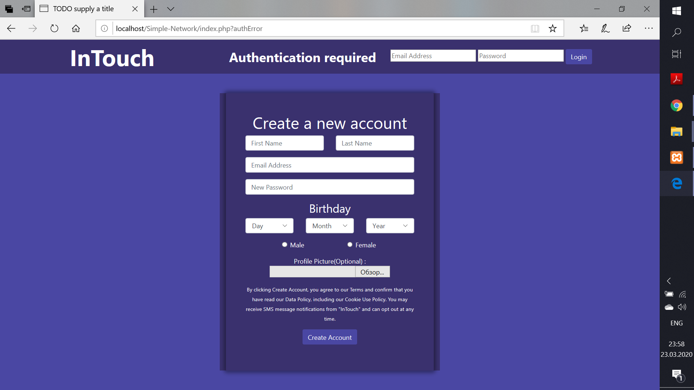
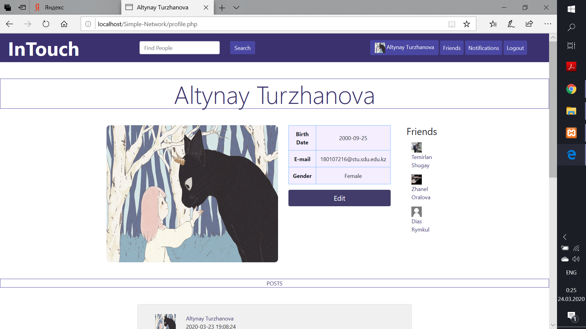
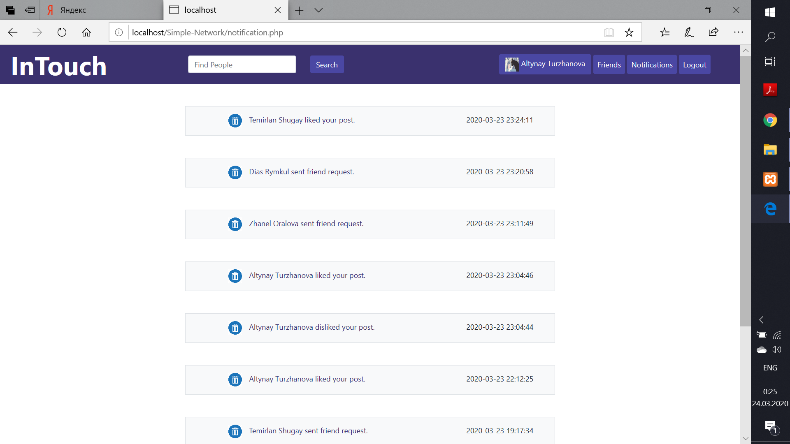
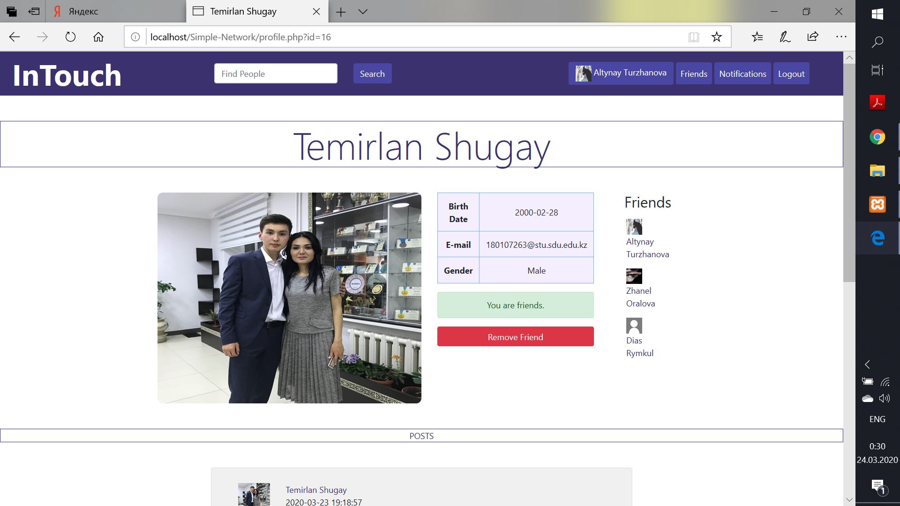

# Social-Networking-Website
```javascript
function done_with_project(project) {
  if(done) {
    grade_me("100 p.");
  }
}
```
## Added files according to midproject
We have covered main parts like registration/loging in, posts, editing, friends, notifications and all other stuff. Later will upload commits one by one with information of whoms work is in which part. We have been waiting for this moment very long time, so that we have forget about commiting the work on git. Sorry for that.
### Registration/Login Page

### Main Page

### Posts Page

### Notifications

### Friend's Page

### Friends List


